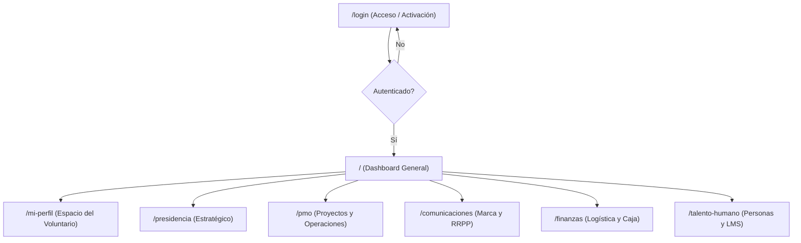
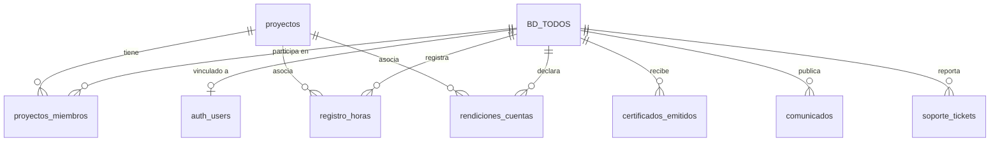
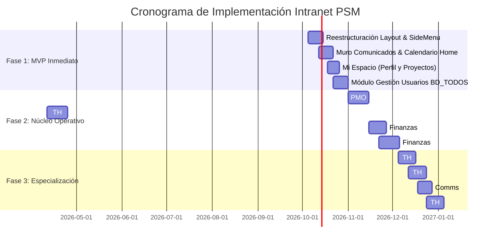

# 🏛️ ARQUITECTURA MODULAR Y PLAN DE IMPLEMENTACIÓN TÉCNICO
## INTRANET PROYECTOS SAN MARCOS (PSM UNMSM)

> **Documento de Especificación de Arquitectura, Modelo de Datos y Hoja de Ruta Táctica**  
> **Versión:** 1.0.0  
> **Fecha:** 04 Octubre 2026  
> **Stack Base:** React 18, Vite 5, Tailwind CSS v4, React Router DOM v6, Lucide React, Supabase (PostgreSQL + Auth + Storage).

---

## 📑 TABLA DE CONTENIDOS
1. [Diagnóstico y Estado Actual del Repositorio](#1-diagnóstico-y-estado-actual-del-repositorio)
2. [Estructura de Navegación y Rutas (UI/UX)](#2-estructura-de-navegación-y-rutas-uiux)
3. [Especificación Funcional Módulo por Módulo](#3-especificación-funcional-módulo-por-módulo)
4. [Diseño del Modelo de Datos (PostgreSQL en Supabase)](#4-diseño-del-modelo-de-datos-postgresql-en-supabase)
5. [Estrategia de Seguridad y Políticas RLS (Row Level Security)](#5-estrategia-de-seguridad-y-políticas-rls)
6. [Plan de Implementación Priorizado por Fases (Sprints)](#6-plan-de-implementación-priorizado-por-fases-sprints)
7. [Lista de Verificación Táctica para React / Vite](#7-lista-de-verificación-táctica-para-react--vite)
8. [Estrategia de Adopción y Migración desde WhatsApp](#8-estrategia-de-adopción-y-migración-desde-whatsapp)

---

## 1. DIAGNÓSTICO Y ESTADO ACTUAL DEL REPOSITORIO

### 1.1 Stack Tecnológico Existente
- **Frontend Core:** React 18.3.1 configurado con Vite 5.4.1.
- **Estilos y Tokens:** Tailwind CSS v4 integrado con `@tailwindcss/vite`, complementado por variables CSS personalizadas en `styles/tokens.css` (Colores PSM: `--psm-navy: #0f2044`, `--psm-teal: #00b4d8`, `--psm-gray-light: #f0f4f8`, tipografías Inter / Oswald / Montserrat).
- **Iconografía:** `lucide-react` para componentes de interfaz moderna.
- **Backend as a Service:** Supabase client (`@supabase/supabase-js` v2.115.0) en `src/lib/supabaseClient.js`.

### 1.2 Flujo de Autenticación Implementado
- **Padrón Base (`BD_TODOS`):** Existe una tabla de miembros con los campos clave:
  `id`, `codigo_universitario`, `nombres`, `apellidos`, `correo_institucional`, `correo_personal`, `gerencia_actual`, `cargo`.
- **Activación de Cuenta (`src/pages/Login.jsx`):**
  1. El voluntario ingresa su código universitario y correo.
  2. El sistema valida la coincidencia exacta contra `BD_TODOS`.
  3. Si es válido y no tiene cuenta previa, invoca `supabase.auth.signUp()` asignando una contraseña temporal (`codigo_universitario + id`) y metadatos (`must_change_password: true`, `role`, `gerencia`, `codigo_universitario`).
- **Control de Acceso (`src/context/AuthContext.jsx` y `src/components/ProtectedRoute.jsx`):**
  - Mantiene el estado del usuario (`user`, `session`, `loading`, `mustChangePassword`).
  - Detecta si el usuario requiere cambio obligatorio de clave (`PasswordChangeModal.jsx`).
  - `ProtectedRoute` bloquea rutas no autorizadas según el rol o gerencia asignada.
- **Layout Actual (`src/components/IntranetDashboard.jsx`):**
  - Barra lateral colapsable (escritorio y móvil).
  - Barra superior con búsqueda, notificaciones, avatar y menú de perfil.
  - Renderizado de páginas secundarias mediante `<Outlet />`.

---

## 2. ESTRUCTURA DE NAVEGACIÓN Y RUTAS (UI/UX)

La navegación se organiza en un esquema de **Dashboard Unificado** con **Vistas Específicas por Gerencia** y un espacio personal para cada voluntario:



### 2.1 Mapa Detallado de Rutas

| Ruta URL | Módulo | Acceso Permitido | Descripción |
| :--- | :--- | :--- | :--- |
| `/login` | Autenticación | Público | Inicio de sesión y activación de cuenta contra `BD_TODOS`. |
| `/` | Dashboard General | Todos los miembros | Comunicados oficiales, calendario institucional y accesos rápidos. |
| `/mi-perfil` | Mi Espacio | Todos los miembros | Mis proyectos, acumulador de horas, certificados PDF, perfil. |
| `/presidencia` | Presidencia | Presidencia, Junta Directiva | Tablero de OKRs/KPIs generales. |
| `/presidencia/actas` | Presidencia | Presidencia, Junta Directiva | Repositorio de actas y acuerdos de Junta. |
| `/presidencia/mejora-continua` | Presidencia | Presidencia, Junta Directiva | Planes de acción correctiva y optimización. |
| `/pmo` | PMO | Todos (Lectura) / PMO (Gestión) | Tablero Kanban y Gantt de proyectos activos. |
| `/pmo/banco-iniciativas` | PMO | Todos (Postulación) / PMO (Eval) | Formulario de postulación y banco de proyectos. |
| `/pmo/plantillas` | PMO | Todos los miembros | Descarga de plantillas oficiales (Charter, EDT, RACI, Riesgos). |
| `/pmo/lecciones-aprendidas` | PMO | Todos los miembros | Repositorio histórico de errores y buenas prácticas. |
| `/pmo/auditoria-calidad` | PMO | PMO, Presidencia | Checklists metodológicos y cierre de proyectos. |
| `/comunicaciones` | Comunicaciones | Todos (Lectura) / Comms (Admin) | Panel general de métricas y anuncios. |
| `/comunicaciones/calendario-editorial` | Comunicaciones | Comunicaciones, Presidencia | Planificador de publicaciones y campañas en redes. |
| `/comunicaciones/brand-kit` | Comunicaciones | Todos los miembros | Descarga de logos oficiales, fuentes y colores corporativos. |
| `/comunicaciones/redactor` | Comunicaciones | Comunicaciones, Presidencia | Gestor para publicar comunicados en el muro principal. |
| `/comunicaciones/rrpp` | Comunicaciones | Comunicaciones, Junta Directiva | CRM de aliados, ponentes, auspicios y cartas formales. |
| `/finanzas` | Finanzas | Finanzas, Junta Directiva | Resumen financiero global y presupuestos. |
| `/finanzas/logistica` | Finanzas | Todos (Solicitudes) / Finanzas (Admin) | Inventario de bienes y solicitud de aulas/equipos UNMSM. |
| `/finanzas/caja-chica` | Finanzas | Finanzas, Directores de Proyecto | Balance de ingresos y egresos por proyecto. |
| `/finanzas/rendiciones` | Finanzas | Todos con presupuesto asignado | Carga de boletas, facturas y comprobantes digitales. |
| `/talento-humano` | Talento Humano | Todos (Vista general) / TH (Admin) | Dashboard de miembros y clima laboral. |
| `/talento-humano/horas` | Talento Humano | Todos (Marcación) / TH (Aprobación) | Registro y validación de horas de voluntariado. |
| `/talento-humano/evaluaciones` | Talento Humano | Todos los miembros | Encuestas de evaluación de desempeño 360°. |
| `/talento-humano/ats` | Talento Humano | Talento Humano, Presidencia | Pipeline de selección y gestión de postulantes. |
| `/talento-humano/directorio` | Talento Humano | Todos los miembros | Directorio telefónico / WhatsApp de voluntarios PSM. |
| `/talento-humano/campus-lms` | Talento Humano | Todos los miembros | Repositorio de talleres, grabaciones y diapositivas. |
| `/talento-humano/certificados` | Talento Humano | Todos (Descarga) / TH (Emisión) | Generador de certificados con firma y verificación QR. |
| `/talento-humano/tecnologia` | Talento Humano / TI | TI, Talento Humano, Presidencia | Panel de miembros (`BD_TODOS`), roles y mesa de ayuda. |

---

## 3. ESPECIFICACIÓN FUNCIONAL MÓDULO POR MÓDULO

### 3.1 Dashboard General (`/`) y Mi Espacio (`/mi-perfil`)
- **Muro de Comunicados:** Carrusel/tarjetas con comunicados oficiales con badge de prioridad (`Urgente`, `Informativo`, `Institucional`) emitidos por Presidencia o Comunicaciones.
- **Calendario Institucional:** Vista mensual y semanal de eventos, entregables clave de PMO, capacitaciones y sesiones generales.
- **Accesos Rápidos ("Quick Action Pills"):**
  1. *Registrar Horas de Hoy* (abre modal rápido conectado a TH).
  2. *Descargar Plantilla PMO* (acceso directo a repositorio de archivos).
  3. *Pedir Aula / Recurso* (formulario de logística).
  4. *Reportar un Problema* (ticket a Mesa de Ayuda).
- **Mi Perfil (`/mi-perfil`):**
  - Tarjeta de identidad del voluntario (nombre, carrera, código, gerencia, cargo).
  - Contador de Horas Acumuladas (aprobadas vs. pendientes).
  - Proyectos en los que participa activamente.
  - Listado de certificados emitidos listos para descargar en PDF.

---

### 3.2 👑 Presidencia (Eje Estratégico y Control)
- **Sub-área: Mejora Continua y Control Organizacional:**
  - **Tablero de Objetivos (OKRs / KPIs):** Cumplimiento porcentual de metas anuales y trimestrales por gerencia. Indicadores visuales de avance (barra de progreso y semáforo verde/ámbar/rojo).
  - **Repositorio de Actas y Acuerdos:** Histórico de reuniones de Junta Directiva, acuerdos tomados, responsables asignados y fecha límite de cumplimiento.
  - **Planes de Mejora:** Registro de hallazgos en auditorías internas y seguimiento a planes de acción correctiva.

---

### 3.3 📐 Gerencia de PMO (Corazón Operativo de Proyectos)
- **Sub-área 1: Innovación, Evaluación y Formación en Proyectos:**
  - **Banco de Proyectos (Iniciativas):** Formulario para postular nuevas propuestas (problema, beneficiarios, presupuesto estimado, cronograma preliminar) y panel de evaluación para el comité PMO.
  - **Tablero Central de Proyectos (Kanban / Gantt):** Vista unificada del estado de proyectos en la UNMSM (`Idea`, `Planificación`, `En Ejecución`, `Monitoreo`, `Cierre`). Métricas de salud del portafolio.
  - **Repositorio de Plantillas Oficiales:** Descarga directa de archivos `.docx`, `.xlsx`, `.pptx` aprobados por PSM:
    - *Project Charter* (Acta de Constitución)
    - *Estructura de Desglose del Trabajo (EDT / WBS)*
    - *Matriz de Asignación de Responsabilidades (RACI)*
    - *Cronograma de Hitos y Matriz de Riesgos*
- **Sub-área 2: Consultoría y Mejora de Procesos:**
  - **Base de Lecciones Aprendidas:** Búsqueda facetada por categoría de proyecto, errores cometidos, soluciones aplicadas y recomendaciones para futuras ediciones.
  - **Lista de Chequeo de Calidad (Auditoría PMO):** Verificación sistemática de artefactos requeridos antes de dar por formalmente finalizado un proyecto.

---

### 3.4 📢 Gerencia de Comunicaciones (Marca, Difusión e Impacto)
- **Sub-área 1: Analíticas y Marketing de Contenidos:**
  - **Calendario Editorial:** Planificación visual mensual de publicaciones (Instagram, LinkedIn, TikTok, Facebook). Estados: `Idea`, `Copy Redactado`, `Diseñado`, `Publicado`.
  - **Kit de Marca (Brand Kit):** Descarga de recursos oficiales: logotipos vectoriales (SVG, PNG transparente), paleta de colores hexadecimales, tipografías corporativas y enlaces a plantillas de Canva Pro de la organización.
  - **Registro de Analíticas:** Registro de métricas por campaña (impresiones, alcance, guardados, clics en enlace).
- **Sub-área 2: Comunicación Interna:**
  - **Gestor de Comunicados:** Editor para publicar anuncios en el Muro de la Intranet con opción de adjuntar imágenes y fijar avisos importantes.
  - **Boletín / Novedades PSM:** Publicación quincenal de logros del voluntariado y proyectos destacados.
- **Sub-área 3: Relaciones Públicas (RRPP):**
  - **Directorio de Aliados (CRM):** Registro de contactos externos clasificados: `Ponente`, `Empresa Auspiciadora`, `Autoridad Sanmarquina`, `Comunidad Aliada`. Historial de interacciones.
  - **Modelos de Cartas Institucionales:** Plantillas estandarizadas para solicitud de patrocinios, invitaciones a conferencistas y cartas de agradecimiento con membrete oficial.

---

### 3.5 💵 Gerencia de Finanzas (Sostenibilidad y Transparencia)
- **Sub-área 1: Logística:**
  - **Inventario de Bienes y Licencias:** Control de inventario físico (roll-ups, chalecos, credenciales, micrófonos) y licencias compartidas (Zoom Pro, Canva Teams, Workspace).
  - **Solicitud de Recursos y Espacios:** Formulario para directores de proyecto para solicitar aulas, auditorios de facultades en UNMSM o equipos multimedia, con estados de aprobación (`Solicitado`, `Aprobado en Facultad`, `Rechazado`).
- **Sub-área 2: Planificación y Control Financiero:**
  - **Control de Caja Chica por Proyecto:** Registro de entradas (presupuesto asignado, patrocinios recaudados) y salidas (gastos corrientes) con balance dinámico.
  - **Módulo de Rendición de Cuentas:** Los directores de proyecto y miembros suben fotografías o PDFs de comprobantes (boletas de venta, facturas, recibos) con monto, fecha, concepto y proyecto asociado para validación del equipo financiero.

---

### 3.6 👥 Gerencia de Talento Humano (Gestión, Desarrollo y Cultura)
- **Sub-área 1: Control, Evaluación e Innovación:**
  - **Control de Asistencia y Registro de Horas:** El voluntario registra la fecha, horas invertidas, proyecto/actividad y evidencia. El líder o TH aprueba o rechaza las horas. Este acumulador alimenta automáticamente la constancia final.
  - **Evaluaciones 360°:** Formularios semestrales de autoevaluación, evaluación entre pares y evaluación de directores.
- **Sub-área 2: Reclutamiento, Selección y Planificación:**
  - **Gestor de Convocatorias (ATS):** Publicación de convocatorias abiertas, formulario público de postulación, pipeline visual de selección (`Postulado`, `Filtro Curricular`, `Entrevista`, `Aceptado`, `Rechazado`).
- **Sub-área 3: Clima y Cultura:**
  - **Directorio de Miembros:** Tarjetas interactivas con foto, nombre, carrera, facultad, gerencia, cumpleaños y botón de WhatsApp directo.
  - **Reconocimientos y Cumpleaños:** Widget en Dashboard que destaca al "Voluntario del Mes" y lista los cumpleaños de la semana.
- **Sub-área 4: Capacitación y Desarrollo (LMS):**
  - **Campus Virtual PSM:** Módulos de formación organizados por áreas (PMO, Liderazgo, Herramientas Ágiles, Habilidades Blandas) con videos de YouTube/Vimeo embebidos y presentaciones descargables.
  - **Emisión de Certificados:** Generador dinámico en PDF con plantilla institucional, nombre del miembro, horas acreditadas y código de verificación único / QR.
- **Sub-área 5: Tecnología y Optimización Digital (Administración):**
  - **Gestión de Usuarios (`BD_TODOS`):** Vista de administración de la tabla maestra: altas, edición de cargos, actualización de gerencia y restablecimiento de contraseña.
  - **Mesa de Ayuda Interna:** Sistema de tickets donde cualquier voluntario reporta bugs o solicita nuevas funcionalidades para la intranet.

---

## 4. DISEÑO DEL MODELO DE DATOS (POSTGRESQL EN SUPABASE)

El esquema relacional aprovecha la autenticación nativa de Supabase (`auth.users`) y la tabla existente `BD_TODOS`, creando tablas normalizadas con llaves foráneas y tipos consistentes.



### 4.1 Definición de Tablas Principales (DDL)

```sql
-- ========================================================
-- 1. TABLA BASE DE MIEMBROS (Existente en producción)
-- ========================================================
-- Nombre actual: BD_TODOS
-- Campos: id (bigint), codigo_universitario (text), nombres (text), 
-- apellidos (text), correo_institucional (text), correo_personal (text), 
-- gerencia_actual (text), cargo (text), estado_activo (boolean default true)

-- ========================================================
-- 2. COMUNICADOS Y NOTIFICACIONES GENERALES
-- ========================================================
CREATE TABLE public.comunicados (
    id UUID PRIMARY KEY DEFAULT gen_random_uuid(),
    titulo VARCHAR(255) NOT NULL,
    contenido TEXT NOT NULL,
    categoria VARCHAR(50) DEFAULT 'General', -- 'Institucional', 'Urgente', 'PMO', 'Eventos'
    es_destacado BOOLEAN DEFAULT false,
    imagen_url TEXT,
    autor_id BIGINT REFERENCES public."BD_TODOS"(id) ON DELETE SET NULL,
    autor_nombre VARCHAR(150),
    created_at TIMESTAMPTZ DEFAULT now(),
    updated_at TIMESTAMPTZ DEFAULT now()
);

-- ========================================================
-- 3. CALENDARIO INSTITUCIONAL
-- ========================================================
CREATE TABLE public.eventos_institucionales (
    id UUID PRIMARY KEY DEFAULT gen_random_uuid(),
    titulo VARCHAR(200) NOT NULL,
    descripcion TEXT,
    fecha_inicio TIMESTAMPTZ NOT NULL,
    fecha_fin TIMESTAMPTZ,
    lugar VARCHAR(255), -- 'Auditorio Facultad de Sistemas' / 'Enlace Google Meet'
    tipo_evento VARCHAR(50), -- 'Taller', 'Junta Directiva', 'Entregable PMO', 'Integracion'
    gerencia_responsable VARCHAR(50),
    created_by BIGINT REFERENCES public."BD_TODOS"(id),
    created_at TIMESTAMPTZ DEFAULT now()
);

-- ========================================================
-- 4. GESTIÓN DE PROYECTOS (PMO)
-- ========================================================
CREATE TABLE public.proyectos (
    id UUID PRIMARY KEY DEFAULT gen_random_uuid(),
    codigo_proyecto VARCHAR(20) UNIQUE NOT NULL, -- Ej: 'PSM-2026-EDU01'
    nombre VARCHAR(255) NOT NULL,
    descripcion TEXT,
    director_id BIGINT REFERENCES public."BD_TODOS"(id),
    gerencia VARCHAR(50) DEFAULT 'PMO',
    estado VARCHAR(50) DEFAULT 'Planificación', -- 'Idea', 'Planificación', 'Ejecución', 'Cierre', 'Cancelado'
    fecha_inicio DATE,
    fecha_fin_estimada DATE,
    fecha_fin_real DATE,
    presupuesto_asignado NUMERIC(10, 2) DEFAULT 0.00,
    salud_proyecto VARCHAR(20) DEFAULT 'En Tiempo', -- 'En Tiempo', 'En Riesgo', 'Crítico'
    created_at TIMESTAMPTZ DEFAULT now()
);

CREATE TABLE public.proyectos_miembros (
    id UUID PRIMARY KEY DEFAULT gen_random_uuid(),
    proyecto_id UUID REFERENCES public.proyectos(id) ON DELETE CASCADE,
    miembro_id BIGINT REFERENCES public."BD_TODOS"(id) ON DELETE CASCADE,
    rol_en_proyecto VARCHAR(100) DEFAULT 'Voluntario', -- 'Líder', 'Coordinador', 'Miembro'
    fecha_asignacion DATE DEFAULT CURRENT_DATE,
    UNIQUE(proyecto_id, miembro_id)
);

CREATE TABLE public.pmo_plantillas (
    id UUID PRIMARY KEY DEFAULT gen_random_uuid(),
    nombre VARCHAR(150) NOT NULL,
    descripcion TEXT,
    categoria VARCHAR(50), -- 'Inicio', 'Planificación', 'Control', 'Cierre'
    archivo_url TEXT NOT NULL,
    extension VARCHAR(10), -- 'docx', 'xlsx', 'pdf'
    version VARCHAR(10) DEFAULT '1.0',
    descargas_count INT DEFAULT 0,
    created_at TIMESTAMPTZ DEFAULT now()
);

CREATE TABLE public.pmo_lecciones_aprendidas (
    id UUID PRIMARY KEY DEFAULT gen_random_uuid(),
    proyecto_id UUID REFERENCES public.proyectos(id),
    titulo VARCHAR(255) NOT NULL,
    que_salio_bien TEXT,
    que_se_puede_mejorar TEXT,
    recomendaciones TEXT NOT NULL,
    autor_id BIGINT REFERENCES public."BD_TODOS"(id),
    created_at TIMESTAMPTZ DEFAULT now()
);

-- ========================================================
-- 5. TALENTO HUMANO: REGISTRO DE HORAS Y ASISTENCIA
-- ========================================================
CREATE TABLE public.registro_horas (
    id UUID PRIMARY KEY DEFAULT gen_random_uuid(),
    miembro_id BIGINT REFERENCES public."BD_TODOS"(id) ON DELETE CASCADE,
    proyecto_id UUID REFERENCES public.proyectos(id) ON DELETE SET NULL,
    fecha_actividad DATE NOT NULL,
    horas NUMERIC(4, 2) NOT NULL CHECK (horas > 0 AND horas <= 24),
    descripcion_tarea TEXT NOT NULL,
    enlace_evidencia TEXT,
    estado VARCHAR(20) DEFAULT 'Pendiente', -- 'Pendiente', 'Aprobado', 'Rechazado'
    revisado_por BIGINT REFERENCES public."BD_TODOS"(id),
    comentario_revision TEXT,
    created_at TIMESTAMPTZ DEFAULT now()
);

-- ========================================================
-- 6. FINANZAS: LOGÍSTICA, RECURSOS Y RENDICIONES
-- ========================================================
CREATE TABLE public.inventario_recursos (
    id UUID PRIMARY KEY DEFAULT gen_random_uuid(),
    nombre_recurso VARCHAR(150) NOT NULL,
    tipo VARCHAR(50), -- 'Físico' (banner, proyector), 'Digital' (licencia Zoom, Canva)
    cantidad_total INT DEFAULT 1,
    cantidad_disponible INT DEFAULT 1,
    responsable_custodia VARCHAR(150),
    credenciales_acceso TEXT, -- Cifrado o restringido
    notas TEXT
);

CREATE TABLE public.solicitudes_recursos (
    id UUID PRIMARY KEY DEFAULT gen_random_uuid(),
    solicitante_id BIGINT REFERENCES public."BD_TODOS"(id) ON DELETE CASCADE,
    proyecto_id UUID REFERENCES public.proyectos(id),
    recurso_id UUID REFERENCES public.inventario_recursos(id),
    espacio_requerido VARCHAR(150), -- 'Aula 204 FISI'
    fecha_uso_inicio TIMESTAMPTZ NOT NULL,
    fecha_uso_fin TIMESTAMPTZ NOT NULL,
    justificacion TEXT NOT NULL,
    estado VARCHAR(20) DEFAULT 'Pendiente', -- 'Pendiente', 'Aprobado', 'Rechazado'
    observaciones_finanzas TEXT,
    created_at TIMESTAMPTZ DEFAULT now()
);

CREATE TABLE public.rendiciones_gastos (
    id UUID PRIMARY KEY DEFAULT gen_random_uuid(),
    proyecto_id UUID REFERENCES public.proyectos(id) ON DELETE CASCADE,
    responsable_id BIGINT REFERENCES public."BD_TODOS"(id),
    fecha_gasto DATE NOT NULL,
    tipo_comprobante VARCHAR(50), -- 'Boleta', 'Factura', 'Recibo por Honorarios'
    numero_comprobante VARCHAR(50),
    monto NUMERIC(10, 2) NOT NULL,
    proveedor VARCHAR(150),
    descripcion_concepto TEXT NOT NULL,
    comprobante_archivo_url TEXT NOT NULL, -- Supabase Storage
    estado_rendicion VARCHAR(20) DEFAULT 'Pendiente', -- 'Pendiente', 'Aprobado', 'Observado'
    created_at TIMESTAMPTZ DEFAULT now()
);

-- ========================================================
-- 7. COMUNICACIONES & RRPP (CRM)
-- ========================================================
CREATE TABLE public.rrpp_contactos (
    id UUID PRIMARY KEY DEFAULT gen_random_uuid(),
    nombre_completo VARCHAR(200) NOT NULL,
    organizacion VARCHAR(200),
    cargo VARCHAR(150),
    categoria VARCHAR(50), -- 'Ponente', 'Empresa', 'Auspiciador', 'Autoridad UNMSM'
    correo VARCHAR(150),
    telefono VARCHAR(50),
    estado_relacion VARCHAR(50) DEFAULT 'Contacto Inicial', -- 'En Negociación', 'Aliado Activo', 'Inactivo'
    notas_seguimiento TEXT,
    created_at TIMESTAMPTZ DEFAULT now()
);

-- ========================================================
-- 8. CAPACITACIÓN & CERTIFICADOS
-- ========================================================
CREATE TABLE public.certificados_emitidos (
    id UUID PRIMARY KEY DEFAULT gen_random_uuid(),
    codigo_verificacion VARCHAR(50) UNIQUE NOT NULL, -- Ej: 'PSM-CERT-2026-A48F'
    miembro_id BIGINT REFERENCES public."BD_TODOS"(id) ON DELETE CASCADE,
    proyecto_o_taller VARCHAR(255) NOT NULL,
    horas_acreditadas NUMERIC(5, 1) NOT NULL,
    fecha_emision DATE DEFAULT CURRENT_DATE,
    pdf_url TEXT,
    firma_digital_hash TEXT,
    created_at TIMESTAMPTZ DEFAULT now()
);

-- ========================================================
-- 9. TECNOLOGÍA: MESA DE AYUDA Y AUDITORÍA
-- ========================================================
CREATE TABLE public.soporte_tickets (
    id UUID PRIMARY KEY DEFAULT gen_random_uuid(),
    usuario_id BIGINT REFERENCES public."BD_TODOS"(id),
    asunto VARCHAR(200) NOT NULL,
    descripcion TEXT NOT NULL,
    modulo_afectado VARCHAR(50), -- 'Login', 'PMO', 'Horas', 'Finanzas'
    prioridad VARCHAR(20) DEFAULT 'Media', -- 'Baja', 'Media', 'Alta', 'Bloqueante'
    estado VARCHAR(20) DEFAULT 'Abierto', -- 'Abierto', 'En Proceso', 'Resuelto', 'Cerrado'
    respuesta_tecnica TEXT,
    created_at TIMESTAMPTZ DEFAULT now()
);
```

---

## 5. ESTRATEGIA DE SEGURIDAD Y POLÍTICAS RLS

Supabase cuenta con Row Level Security (RLS) habilitado por defecto en PostgreSQL.

### 5.1 Función Helper para Extraer el Miembro Autenticado
Para relacionar la sesión activa de `auth.users` con el registro correspondiente de `BD_TODOS`, creamos una función auxiliar en Postgres:

```sql
CREATE OR REPLACE FUNCTION public.get_current_member_id()
RETURNS BIGINT AS $$
  SELECT (auth.jwt() -> 'user_metadata' ->> 'member_id')::BIGINT;
$$ LANGUAGE SQL STABLE;

CREATE OR REPLACE FUNCTION public.get_current_member_role()
RETURNS TEXT AS $$
  SELECT coalesce(auth.jwt() -> 'user_metadata' ->> 'role', 'Voluntario');
$$ LANGUAGE SQL STABLE;
```

### 5.2 Políticas de Ejemplo para Tablas Críticas

#### A. Tabla `registro_horas`
```sql
ALTER TABLE public.registro_horas ENABLE ROW LEVEL SECURITY;

-- 1. Un voluntario solo puede ver sus propias horas registradas
CREATE POLICY "Voluntario ve sus propias horas"
ON public.registro_horas FOR SELECT
TO authenticated
USING (
    miembro_id = public.get_current_member_id()
    OR public.get_current_member_role() IN ('Talento Humano', 'Presidencia', 'Junta Directiva')
);

-- 2. Un voluntario solo puede insertar horas para sí mismo
CREATE POLICY "Voluntario inserta sus propias horas"
ON public.registro_horas FOR INSERT
TO authenticated
WITH CHECK (
    miembro_id = public.get_current_member_id()
);

-- 3. Solo Talento Humano o Presidencia pueden aprobar o actualizar el estado
CREATE POLICY "TH y Presidencia actualizan estado de horas"
ON public.registro_horas FOR UPDATE
TO authenticated
USING (
    public.get_current_member_role() IN ('Talento Humano', 'Presidencia', 'Junta Directiva')
);
```

#### B. Tabla `pmo_plantillas` y `comunicados`
- **Lectura:** Todos los usuarios autenticados (`TO authenticated USING (true)`).
- **Escritura:** Restringida por rol (`PMO` para plantillas, `Comunicaciones` y `Presidencia` para comunicados).

### 5.3 Storage Buckets Requeridos
Configurar los siguientes buckets en Supabase Storage:
1. `pmo-templates`: Público para lectura de miembros autenticados; escritura exclusiva de rol `PMO`.
2. `comprobantes-finanzas`: Privado; acceso para el autor del gasto y el rol `Finanzas`.
3. `certificados-pdf`: Público con URLs firmadas para validación externa mediante código QR.
4. `brand-kit`: Público para descarga libre de logotipos y vectores.
5. `comunicados-media`: Público para renderizado de imágenes en el muro principal.

---

## 6. PLAN DE IMPLEMENTACIÓN PRIORIZADO POR FASES (SPRINTS)

El desarrollo se programa en **3 Fases de 2 Sprints cada una** (duración estimada: 2 a 3 semanas por sprint).



### 🚀 FASE 1: MVP INMEDIATO (Sprints 1 y 2)
**Objetivo:** Consolidar una interfaz moderna, robusta y accesible para toda la base de voluntarios, completando el flujo de información institucional y la administración de usuarios.

- **Sprint 1.1: Navegación y Shell UI:**
  - Modernizar `IntranetDashboard.jsx` y `SideNavigation.jsx`: Menú lateral jerárquico con acordeón por cada una de las 5 gerencias y sus respectivas subáreas.
  - Implementar breadcrumbs y badge de rol visible.
  - Crear la ruta `/mi-perfil` mostrando la ficha del voluntario conectada a `BD_TODOS`.
- **Sprint 1.2: Muro y Gestión:**
  - Implementar la tabla `comunicados` y alimentar el Dashboard Principal (`/`).
  - Implementar el widget de Calendario institucional en el Home.
  - Construir la vista de **Administración de Miembros** (`/talento-humano/tecnologia` o `/usuarios`) para visualizar el padrón de `BD_TODOS`, estado de activación y cambio de contraseñas.

---

### ⚙️ FASE 2: NÚCLEO OPERATIVO (Sprints 3 y 4)
**Objetivo:** Digitalizar los flujos diarios de trabajo para que el voluntariado dependa positivamente de la intranet.

- **Sprint 2.1: PMO y Talento Humano:**
  - **PMO Plantillas:** Interfaz para subir y descargar con un clic las plantillas oficiales (Charter, EDT, RACI, Cronograma).
  - **PMO Tablero:** Visualizador Kanban de proyectos activos clasificados por estado.
  - **TH Registro de Horas:** Formulario de marcación de horas para el voluntario y bandeja de revisión y aprobación para el líder de área o TH.
- **Sprint 2.2: Finanzas y Logística:**
  - **Catálogo de Recursos e Inventario:** Visualizador de bienes y licencias disponibles.
  - **Formulario de Solicitud de Aulas/Espacios UNMSM:** Con aprobación secuencial y notificación.
  - **Caja Chica y Rendiciones:** Formulario para subir boletas/facturas en imagen o PDF asociadas al presupuesto de cada proyecto.

---

### 🌟 FASE 3: ESPECIALIZACIÓN Y AUTOMATIZACIÓN (Sprints 5 y 6)
**Objetivo:** Completar las capacidades avanzadas de formación, certificación, reclutamiento y relaciones públicas.

- **Sprint 3.1: Formación y Reconocimiento:**
  - **LMS Campus Virtual:** Estructura de cursos y talleres grabados con incrustación de video responsivo y material anexo.
  - **Generador de Certificados PDF:** Emisión automática de constancias de horas con librería cliente (`jspdf`), diseño membretado PSM y código QR único de validación.
  - **Reconocimientos & Cumpleaños:** Tarjeta semanal en el dashboard destacando el cumpleaños de los voluntarios y reconocimiento mensual.
- **Sprint 3.2: RRPP, ATS y Mesa de Ayuda:**
  - **CRM RRPP:** Directorio de auspiciadores y ponentes con historial de cartas emitidas.
  - **ATS de Convocatorias:** Formulario externo para postulantes y pipeline de entrevistas para Talento Humano.
  - **Mesa de Ayuda (Soporte TI):** Buzón interno para incidencias y peticiones técnicas de la intranet.

---

## 7. LISTA DE VERIFICACIÓN TÁCTICA PARA REACT / VITE

Para ejecutar las fases sin alterar ni romper el flujo de autenticación existente:

### 7.1 Estructura Modular Sugerida de Archivos en `src/`

```text
src/
├── components/
│   ├── common/              # Componentes UI reutilizables
│   │   ├── Badge.jsx
│   │   ├── DataTable.jsx
│   │   ├── FileUploader.jsx
│   │   ├── Modal.jsx
│   │   └── Tabs.jsx
│   ├── IntranetDashboard.jsx # Shell principal (Sidebar + Navbar + Outlet)
│   ├── PasswordChangeModal.jsx
│   └── ProtectedRoute.jsx   # Guardián de rutas y roles
├── context/
│   └── AuthContext.jsx      # Sesión global con Supabase Auth
├── lib/
│   └── supabaseClient.js    # Conexión Supabase
├── pages/
│   ├── DashboardHome.jsx     # Portada con Muro, Calendario y Quick Actions
│   ├── Login.jsx            # Autenticación y Activación contra BD_TODOS
│   ├── perfil/
│   │   └── MiPerfilPage.jsx # Proyectos propios, horas acumuladas y certificados
│   ├── presidencia/
│   │   ├── OkrsPage.jsx
│   │   ├── ActasPage.jsx
│   │   └── MejoraContinuaPage.jsx
│   ├── pmo/
│   │   ├── PmoDashboardPage.jsx
│   │   ├── BancoIniciativasPage.jsx
│   │   ├── PlantillasPmoPage.jsx
│   │   ├── LeccionesAprendidasPage.jsx
│   │   └── AuditoriaCalidadPage.jsx
│   ├── comunicaciones/
│   │   ├── CalendarioEditorialPage.jsx
│   │   ├── BrandKitPage.jsx
│   │   ├── GestorComunicadosPage.jsx
│   │   └── RrppCrmPage.jsx
│   ├── finanzas/
│   │   ├── LogisticaRecursosPage.jsx
│   │   ├── CajaChicaPage.jsx
│   │   └── RendicionCuentasPage.jsx
│   └── talento-humano/
│       ├── RegistroHorasPage.jsx
│       ├── DirectorioMiembrosPage.jsx
│       ├── EvaluacionesPage.jsx
│       ├── CampusLmsPage.jsx
│       ├── CertificadosPage.jsx
│       ├── AtsConvocatoriasPage.jsx
│       └── TecnologiaAdminPage.jsx
└── services/                # Servicios modulares de Supabase API
    ├── comunicadosService.js
    ├── pmoService.js
    ├── horasService.js
    ├── finanzasService.js
    └── usuariosService.js
```

### 7.2 Checklist de Tareas Técnicas de Ejecución Inmediata

- [ ] **Preservar `AuthContext.jsx` y `Login.jsx`:** Mantener intacto el esquema de activación que compara `codigo_universitario` y correos contra `BD_TODOS`.
- [ ] **Actualizar Menú Lateral (`IntranetDashboard.jsx`):**
  - Transformar el array estático de navegación en una estructura jerárquica con sub-menús desplegables por gerencia.
  - Incorporar la sección fija "Mi Espacio" (`/mi-perfil`) accesible para cualquier rol.
- [ ] **Configurar Nuevas Rutas en `src/App.jsx`:**
  - Registrar las rutas anidadas dentro de `<Route path="/" element={<IntranetDashboard />}>`.
  - Proteger rutas restringidas usando `<ProtectedRoute allowedRoles={['...']}>`.
- [ ] **Servicios Supabase Desacoplados:**
  - Crear funciones en `src/services/` para encapsular las llamadas `.from('nombre_tabla')`, facilitando el control de errores y estados de carga.
- [ ] **Dependencias Recomendadas a Instalar:**
  - `jspdf` y `html2canvas`: Para la generación e impresión de certificados PDF en el cliente.
  - `qrcode.react`: Para imprimir el código QR de validación en los certificados.

---

## 8. ESTRATEGIA DE ADOPCIÓN Y MIGRACIÓN DESDE WHATSAPP

Uno de los principales retos en voluntariados universitarios es el abandono de los sistemas web a favor de la inmediatez de WhatsApp. Para garantizar un uso diario y orgánico, aplicaremos la estrategia del **"Trámite Obligatorio y Enlace Directo"**:

### 8.1 La Regla del Trámite Obligatorio
Ningún beneficio ni documento oficial se entrega por chat privado:
1. **Constancias de Voluntariado:** Solo se emitirán a quienes registren semanalmente sus horas en `/talento-humano/horas`.
2. **Plantillas Oficiales de PMO:** Prohibido compartir archivos `.docx` sueltos en grupos; se comparte el enlace directo `/pmo/plantillas`.
3. **Solicitud de Presupuesto y Comprobantes:** Finanzas solo reembolsa gastos subidos y justificados en `/finanzas/rendiciones`.
4. **Reserva de Aulas UNMSM:** Trámite exclusivamente canalizado por `/finanzas/logistica`.

### 8.2 Protocolo de Deep Linking para Líderes
Capacitar a los directores de gerencia para que, ante cualquier consulta en grupos de WhatsApp, respondan con el enlace directo:
- *"¿Dónde está el formato de Project Charter?"*  
  👉 *Respuesta:* *"Descárgalo directamente aquí: [intranet.proyectosanmarcos.com/pmo/plantillas](https://intranet.proyectosanmarcos.com/pmo/plantillas)"*
- *"¿Puedo separar el aula para la sesión de mañana?"*  
  👉 *Respuesta:* *"Ingresa tu solicitud en el sistema: [intranet.proyectosanmarcos.com/finanzas/logistica](https://intranet.proyectosanmarcos.com/finanzas/logistica)"*

### 8.3 Diseño Pensado para Móviles (Mobile First & PWA)
- Los voluntarios consultan sus pendientes desde el celular en los pasillos de la universidad. El menú lateral colapsable y los botones táctiles grandes ya implementados garantizan que la intranet funcione con fluidez desde cualquier navegador móvil.
- Configurar la web app con `manifest.json` para permitir la opción "Agregar a la pantalla principal", permitiendo que los miembros la abran con un solo toque como una app nativa.

---

## 9. CONCLUSIÓN Y PRÓXIMOS PASOS

Este documento sirve como la guía maestra de desarrollo para el equipo de tecnología de Proyectos San Marcos. El siguiente paso consiste en la **revisión y validación de esta arquitectura** por parte de los líderes de proyecto, tras lo cual se procederá con la ejecución del **Sprint 1.1** (Reestructuración del Sidebar jerárquico y creación del Espacio Personal `/mi-perfil`).
